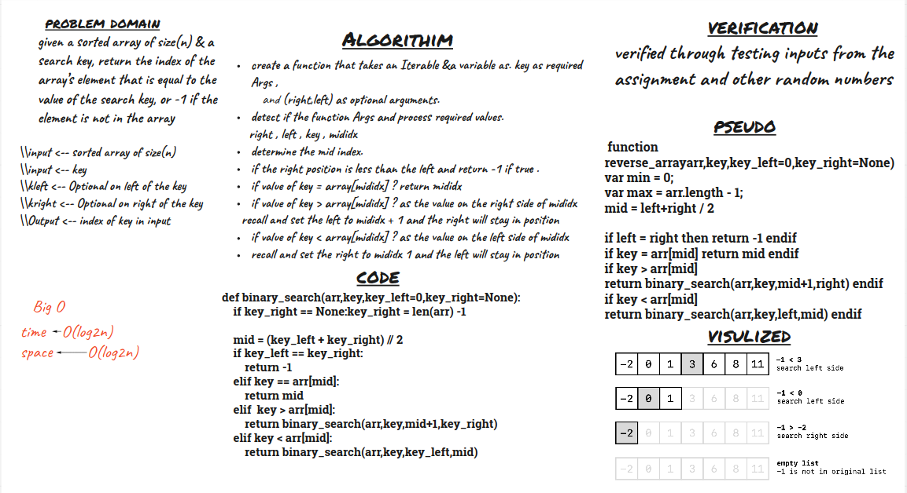

# Insert to Middle of an Array
> given a sorted array of size(n) & a search key, return the index of the array’s element that is equal to the value of the search key, or -1 if the element is not in the array

## Whiteboard Process

## Approach & Efficiency
i will search the key with recursion, so i can practice more on recirsion

> *time <- O(__log__ <small>2</small>n)  *
> *space <- O(__log__ <small>2</small>n)* 
