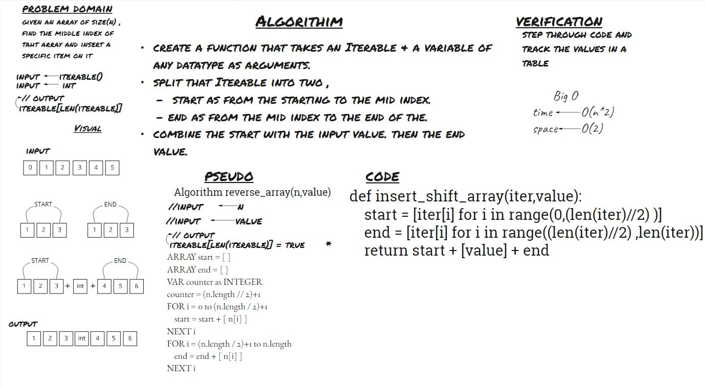

# Insert to Middle of an Array
> given an array of size(n) , find the middle index of taht array and insert a specific item on it

## Whiteboard Process

## Approach & Efficiency
after a long day , the first solution came in my mind was to split the array into two parts and then merge them back together. with the input value added in between the two parts.

> *time <- O(1)*  
> *space <- O(n)*
