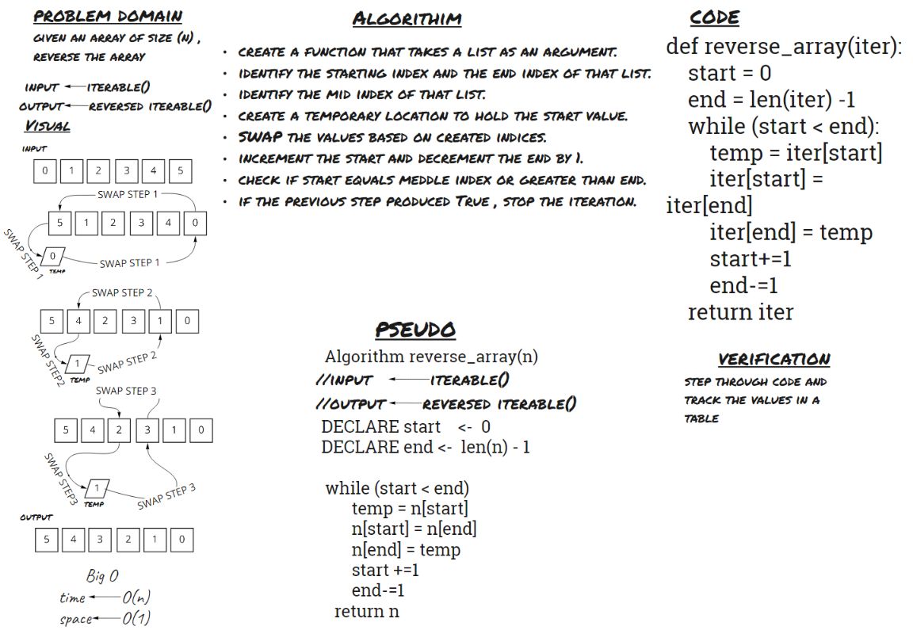

# Reverse an Array
- given an array of size (n) ,reverse the array

## Whiteboard Process

## Approach & Efficiency
solved the problem using SWAP approach without consuming any extra space which will lead to O(n) time complexity and  O(1) space complexity