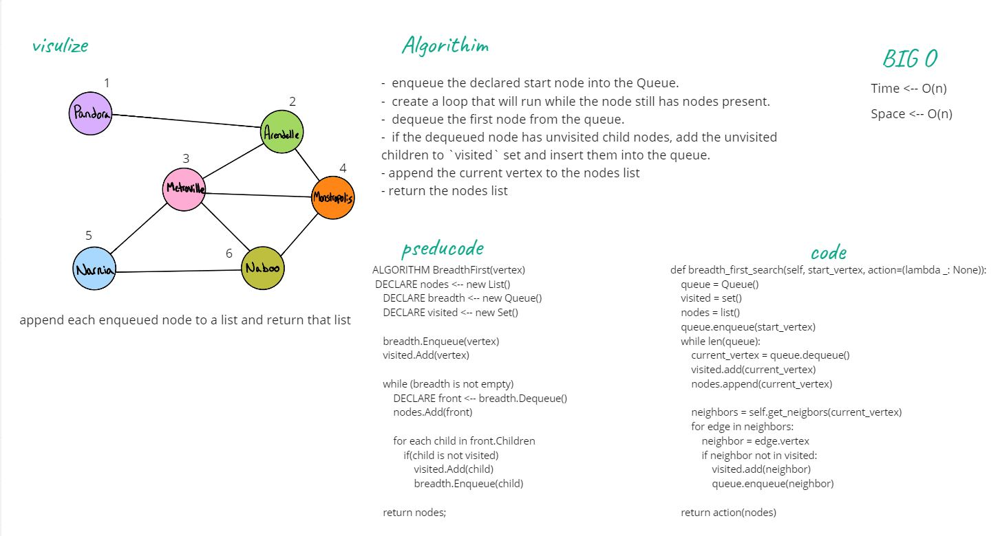

# Challenge Summary
## breadth-first traversal on a graph.

The breadth-first traversal of a graph is like that of a tree, with the exception that graphs can have cycles.

breadth_first_search
    - Arguments:
        start_vertix
        action
    - Returns data based on action sent

## Whiteboard Process

## Approach & Efficiency
Time --> O(n)

Space --> O(n)

## Solution
[Code](../graph.py)

