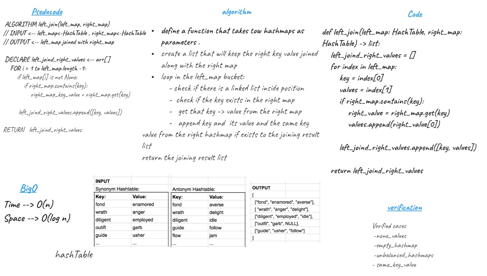

# Challenge Summary
Implement a simplified LEFT JOIN for 2 Hashmaps.

## Whiteboard Process

## Approach & Efficiency
iterate the bucket of the left map and check if the key exists in the right map , then get its value
    and append it to the same key values .

    - Time -> O(n)
    - Space -> O(log n)

## solution

[Code](hashmap_lj.py)

[Test](test_hashmap.py)
