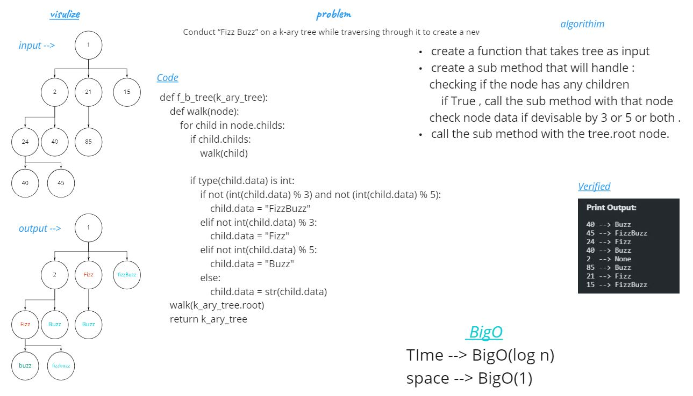

# Daily Code Challenge

## k-ary-Trees  “FizzBuzz”
Author: Odeh Abuzaid

---

### Problem Domain
Conduct “FizzBuzz” on a k-ary tree while traversing through it to create a new tree.

---
### Big O

| Time | Space |
| :----------- | :----------- |
| O(log n)  | O(1) |

---

## Whiteboard Process

## Approach & Efficiency
recursivly walk through node childs if exist and check the values for each child , apply Fizz-Buzz on nodes data from the last node to the first node of root childs.
