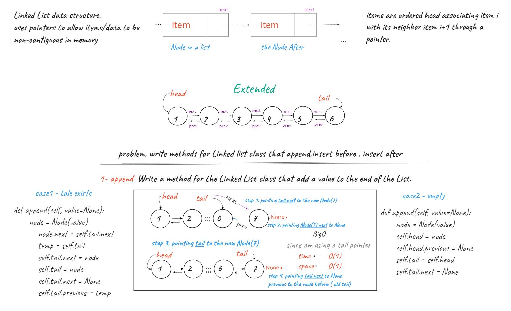
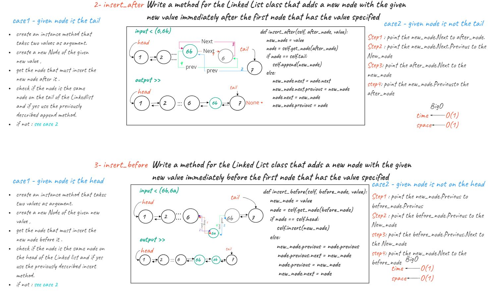

# Daily Code Challenge

## linked list
*Author: Odeh Abuzaid*

---

### Problem Domain
Create a Node class that has properties for the value stored in the Node, and a pointer to the next Node.

---

### Inputs and Expected Outputs

example :
```py
arr = ["1", "2", "3", "4", "5"]
iter_values = LinkedList(arr)

print(iter_values) # {1} -> {2} -> {3} -> {4} -> {5} -> Null
```

extended :
```py
# list head -> [1] -> [3] -> [2] -> X

linkedList.append(5)

# head -> [1] -> [3] -> [2] -> [5] -> X

# head -> [1] -> [3] -> [2] -> X
linkedList.insert_before(3, 5)

# head -> [1] -> [5] -> [3] -> [2] -> X

# ...
```
---

## *WhiteBoard updates*
<br>



---
### Change Log
***
14.oct 2021 first commit

16.oct 2021

- fixed : includes method that indicates whether that value exists as a Node’s value somewhere within the list.

- fixed : return string formating.
- fixed : test import links.
- added : tests that met with all requirements.
- added : `__iter__`  to LinkedList :   yields every single node.
- added : `__main__` :   Verify & Validate Requirements
- added : `collect`  :   returns a collection of all the values exists

17.oct 2021

    Extended Linked List allow various insertion methods.
- fixed : nodes by Value
- added : `append` a node at the end
- added : `insert_after` insert a node after value
- added : `insert_before` insert a node before value
- added : `get_node` return a `<Node>` of value
- added : `delete` removes a `<Node>` by value
- added : `delete_all_nodes` removes all Nodes
- added : `kth_from_end` Return the node’s value that is k as argument places from the tail of the linked list.
---


