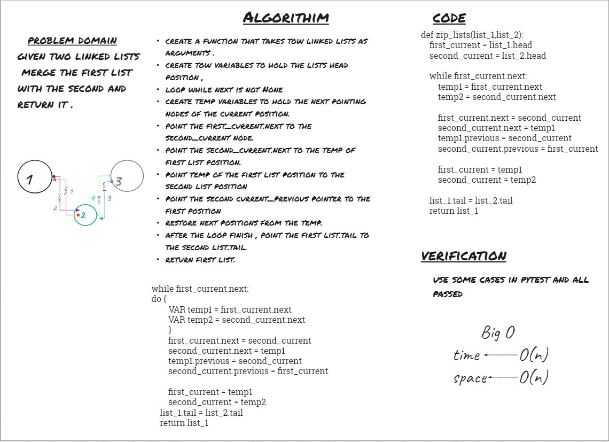

# linked-list-zip
- Zip two linked lists.

## Whiteboard Process

## Approach & Efficiency
solved the problem using next and previous pointers with a while loop , as the next pointer is not pointer is not pointing to None, will insert a node from the second list and increment both of them.

