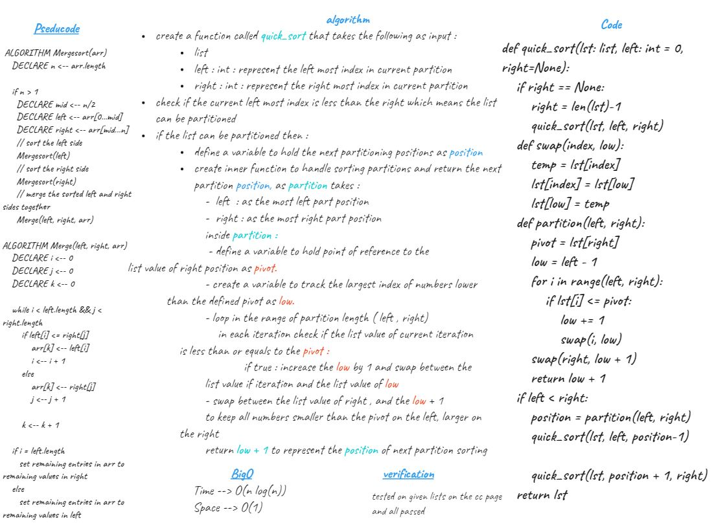
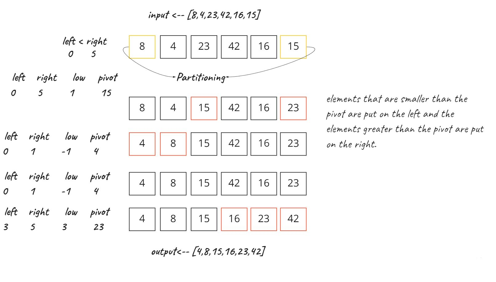

# Challenge Summary
## Quick Sort

## Whiteboard Process

## Approach & Efficiency
 ## Divide and Conquer.

Time --> O(n log(n))

Space --> O(1)

## Solution
divide the list into partitions by selecting a pivot element from the list.

on partitioning, the pivot element should be positioned in such a way that elements less than pivot are kept on the left side if pivot index and elements greater than pivot are on the right side of the pivot index.

[BLOG.md](BLOG.md)

