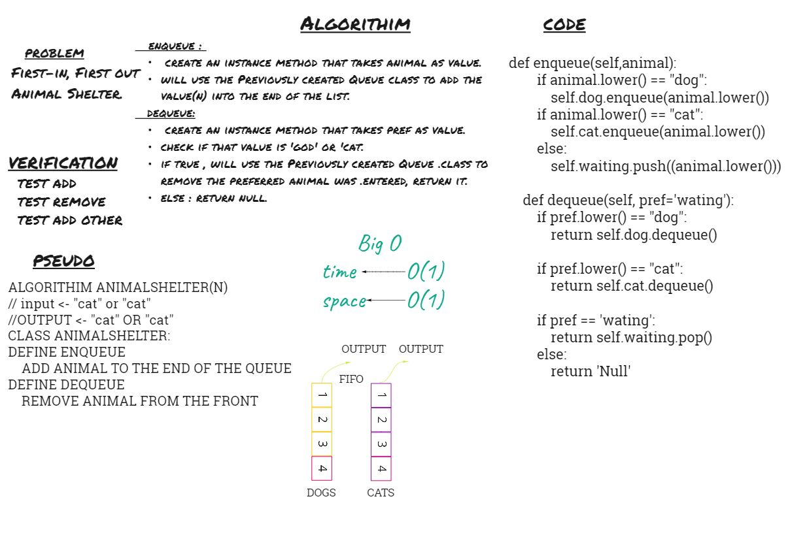

# Daily Code Challenge

## linked list
Author: Odeh Abuzaid

---

### Problem Domain
Using a Linked List as the underlying data storage mechanism, implement both a Stack and a Queue

---
### Big O

For Both Stack Class and Queue Class Methods.

| Time | Space |
| :----------- | :----------- |
| O(1) | O(1) |

---

## Whiteboard Process

## Approach & Efficiency
 first-in, first-out approach.

