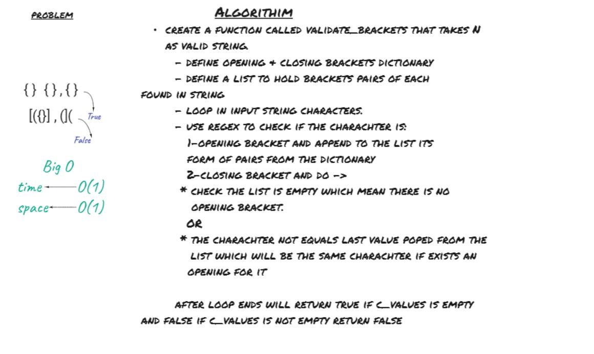

# Daily Code Challenge

## Multi-bracket Validation
Author: Odeh Abuzaid

---

### Problem Domain
Write a function called validate brackets

    Arguments: string

    Return: boolean

Representing whether or not the brackets in the string are balanced

---

## Whiteboard Process

## Approach & Efficiency

### Big O

For Both Stack Class and Queue Class Methods.

| Time | Space |
| :----------- | :----------- |
| O(n) | O(1) |

---
