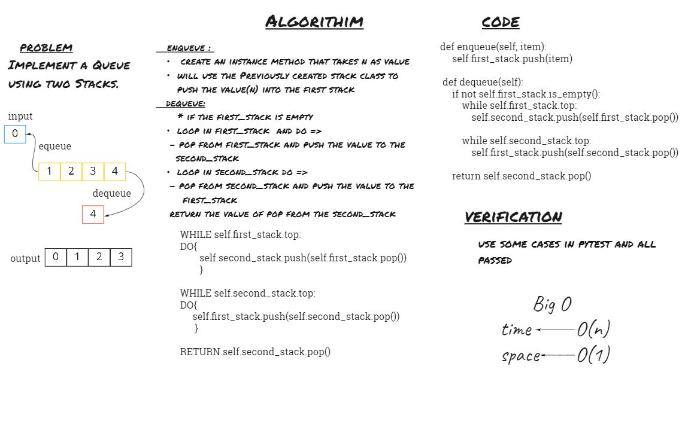

# Challenge Summary
## Implement a Queue using two Stacks.

## Whiteboard Process

## Approach & Efficiency
i will solve this problem by inserting nodes in the first stack, then reverse the nodes by moving them to the second stack and pop to dequeue.

| Time | Space |
| :----------- | :----------- |
| O(n) | O(1) |
## Solution
<!-- Show how to run your code, and examples of it in action -->
