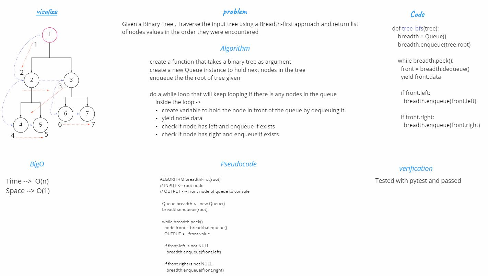

# Daily Code Challenge

## Breadth-first Traversal.
Author: Odeh Abuzaid

---

### Problem Domain
Given a Binary Tree , Traverse the input tree using a Breadth-first approach and return list of nodes values in the order they were encountered

---
### Big O

| Time | Space |
| :----------- | :----------- |
| O(n)  | O(1) |

---

## Whiteboard Process

## Approach & Efficiency
walk the tree nodes using Breadth-first Algorithm with a Queue ,after each dequeue will yield the nodes values

