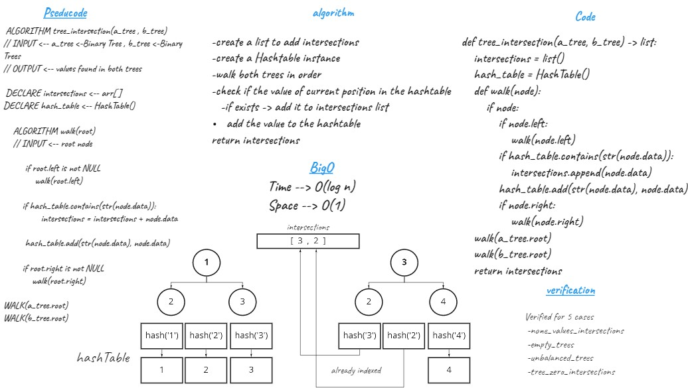

# Challenge Summary
Find common values in two binary trees.

## Whiteboard Process

## Approach & Efficiency
Recursion

walk first tree and insert nodes values to hash table then walk the second tree
and check if the value at current position is in the hash table based on its hashed value as index
append it to list of intersections.

Time -> O(log n)

Space -> O(1)

## Solution

[Code](tree_intersection.py)

